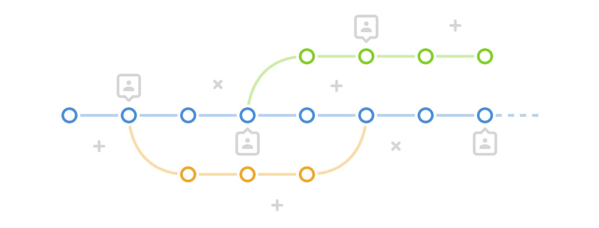

# Git-koulutus  

Oletus on että oppilaat eivät juuri ole käyttäneet gittiä mutta haluavat oppia käyttämää sitä. Harjoitusten tavoitteena on että opitaan perus git workflow monikehittäjäympäristössä sekä siihen tarvittavat työkalut (koodieditori, pääte, git, github) käytännön tehtävän kautta. Lopuksi kerrataan opitut asiat ja annetaan läksy.

>Jos disainerit osais käyttää gittiä ja komentoriviä ne veis meidän naiset ja työt  
>Ainoa este siihen on niiden osaamattomuus gitissä ja komentorivin käytössä  
>– Vessi

## Ennakkotehtävä

1. [Luo github-tunnarit](https://github.com/join), jos ei sulla jo ole
1. Lisää oikea nimesi ja kuvasi github-profiiliin
1. Kerro github usernamesi släkissä [#admin](https://reaktor.slack.com/messages/admin/) kanavalla ja pyydä lisäämään reaktorians-ryhmään
1. Liity släkissä kanavalle [#git-koulutus](https://reaktor.slack.com/messages/git-koulutus/)
1. Asenna [Atom](https://atom.io/) ja [GitX](http://rowanj.github.io/gitx/)
1. Jos haluat, tee GitHubin [Try Git](https://try.github.io)-harjoitus

## Harjoituksen agenda

#### Perusteet
- Intro gitistä: mikä se on ja mikä on tämä versiohallinta?!
- Laitetaan kehitysympäristö pystyyn, me pidetään sua kädestä kiiinni
- Käydään läpi perusteet: `status`, `add`, `commit`, `log` ja `diff`

#### Ryhmätyöskentely
- Tutustuaan GitHubiin
- Jakaudutaan pienryhmiin ja tutustutaan ryhmätyöskentelyn saloihin: `push`, `pull`, `rebase`, `merge` ja `fetch`
- Tehdään muutama harjoitus

#### Visujen tunkkaus
- Muokataan olemassa olevaa palvelun kottareita

## Lisää lukemista

- [Reaktor Git perusteet "ei koodaajille"](https://extra.reaktor.fi/pages/viewpage.action?pageId=50922108)
- [Code Academy: Learn Git](https://www.codecademy.com/learn/learn-git) - Samoja asioita ja ehkä vähän lisää jota tässä koulutuksessa käytiin läpi
- [GitHub Guides](https://guides.github.com/) - Erityisesti kahteen ensimmäiseen kannattaa tutustua
